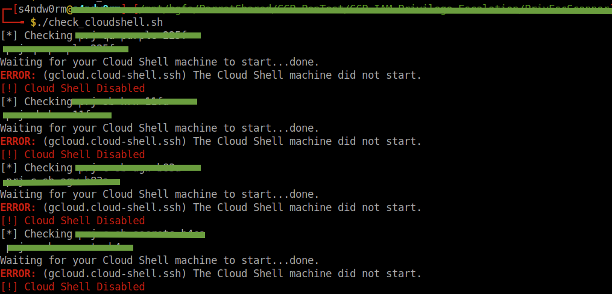

# GCP_Pen_Testing_Tools

Some tools to automate GCP pen testing.
Twitter: @achrafjellal

## check_cloudshell
This script checks if Cloud Shell is enabled on all projects within the GCP account. 
[Link](https://github.com/achrafjellal/GCP_Pen_Testing_Tools/blob/main/check_cloudshell.sh)

